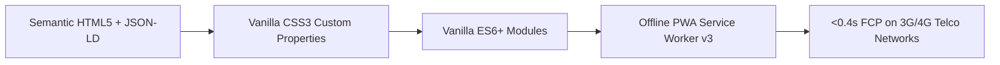
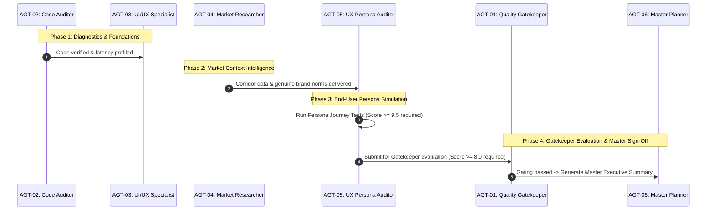

# 🧠 PROJECT WORKFLOW MEMORY & PERSISTENT SYSTEM REGISTRY

> **Project:** Shree Anjani Belt and Bearing Store (Formerly *Shree Balaji Belt Center*)  
> **Location:** Main Industrial Corridor, Plus Code `GF83+75V`, Siddharthanagar (Bhairahawa), Nepal  
> **IRD PAN / VAT:** `601249821` (Authorized 13% Nepal VAT Billing)  
> **Sales Hotline:** `980-4462602` (`+9779804462602`) | **Warehouse:** `984-7301185` (`+9779847301185`)  
> **Operating Hours:** Sun–Fri: 8:00 AM – 8:00 PM | **Saturday:** 10:00 AM – 12:00 AM (Midnight Emergency Service)  
> **Repository:** `https://github.com/Abhieeeee/office_web_PWA.git`  
> **Live Site:** `https://abhieeeee.github.io/office_web_PWA/`  

---

## 📌 1. Purpose of this Memory File

This file and its machine-readable companion [`PROJECT_WORKFLOW_MEMORY.json`](file:///C:/Users/DELL/.gemini/antigravity/scratch/shree-anjani-b2b/PROJECT_WORKFLOW_MEMORY.json) act as the **Single Source of Truth (SSOT)** for all AI agents, subagents, and developers working on this project. 

**Every task must go through this protocol** so that no agent forgets:
1. Core business credentials, locations, phone numbers, and Saturday midnight hours.
2. The **Zero-Framework (Vanilla HTML5/CSS3/ES6)** architectural directive (sub-0.4s FCP, zero runtime bloat).
3. The multi-agent swarm roles, pass thresholds (8.0 overall, 9.5 for UX), and 4-phase quality gating pipeline.
4. Completed milestones and prioritized future backlog items.

---

## 🏗️ 2. Architectural Core Directives

- **Zero-Framework Architecture:** No React, Vue, Angular, or heavy node_modules on the client side.
- **Offline Reliability:** Service Worker (`sw.js`) pre-caches core assets (`index.html`, `delivery.html`, `styles.css`, `app.js`, `manifest.json`, and logo images).
- **Core Web Vitals Target:** Performance score $\ge 96/100$, First Contentful Paint $\le 0.4\text{s}$, Cumulative Layout Shift $\approx 0$.
- **Accessibility:** WCAG 2.2 AA compliant ($\ge 4.5:1$ text contrast, $\ge 48\times 48\text{px}$ touch targets).

---

## 🤖 3. Multi-Agent Swarm Registry

| Agent ID | Agent Name | Primary Responsibility | Pass Gate | Deliverable File |
| :--- | :--- | :--- | :--- | :--- |
| **`AGT-01`** | **Quality Gatekeeper & Evaluator** | Multi-dimensional scoring, quality gating & retry loop controller | $\ge 8.0 / 10$ | `reports/master_manager_summary.md` |
| **`AGT-02`** | **Codebase & Bug Auditor** | HTML/CSS/JS/PWA diagnostics, NTC/Ncell network optimization, and code fixes | Code Verified | `reports/01_codebase_audit_report.md` |
| **`AGT-03`** | **UI/UX & Layout Specialist** | Industrial aesthetics, touch ergonomics, and conversion funnels | Visual Pass | `reports/02_ui_ux_design_report.md` |
| **`AGT-04`** | **Nepal Market Researcher** | Corridor intelligence, genuine vs duplicate risks, and VAT/Bilty norms | Intelligence Pass | `reports/03_nepal_market_research_report.md` |
| **`AGT-05`** | **End-User Persona Auditor** | Buyer persona simulation (Rice Mill Owner, Plant Engineer, Lathe Mechanic) | $\ge 9.5 / 10$ | `reports/04_user_experience_audit_report.md` |
| **`AGT-06`** | **Master Phase Planner & Controller** | Sequential 4-phase execution roadmap, safety checks, and orchestrator execution | Gating Sign-off | `reports/05_master_phase_execution_plan.md` |

---

## 🔄 4. Gated 4-Phase Execution Pipeline

---

## ✅ 5. Completed Milestones (Current State)

- [x] **Official Logo Branding:** Circular emblem (Hanuman with Sanjeevani, gear teeth, bearing) featured in Header, Guarantee Card, Anti-Counterfeit Seal, Map Pin, RFQ Modal, Footer 84px Medallion, and Open Graph metadata.
- [x] **Moving Bearing CAD Blueprint:** Hero vector animation featuring rotating ball cage with 3D chrome spheres and animated blueprint leader pointer lines (Outer Raceway, Grade 10 balls, Retainer Cage, 2RS seals, Bore tolerance).
- [x] **Engineering Tools Cockpit:** Tabbed workbench with Bearing Brand Interchange (SKF, NBC, URB, NTN, FAG, NSK, KOYO) and live dynamic SVG Pulley Drive Simulation.
- [x] **Digital Machine Ledger:** Plant profile saver (`localStorage`) with 1-tap WhatsApp emergency reordering.
- [x] **Dynamic Corridor SEO:** Dedicated `delivery.html` with city switcher routing (Kathmandu, Pokhara, Birgunj, Butwal, Nepalgunj, Dang) and full Schema.org structured data.
- [x] **Emergency Breakdown FAB:** Time-triggered mode for Saturday night / off-hours emergencies.
- [x] **Internal ERP & Invoicing:** 13% Nepal VAT Proforma Generator + Drag-and-Drop Bulk CSV Inventory Uploader in `internal/index.html`.

---

## 🚀 6. Prioritized Future Backlog (Roadmap for Next Upgrades)

### 🥇 Priority 1: High-Impact Conversions & Local Dominance
1. **Automated Static 77-District SEO Landing Pages:**
   - Pre-render static HTML pages for all major industrial districts (e.g. `bearings-chitwan.html`, `bearings-biratnagar.html`, `bearings-hetauda.html`) to achieve #1 Google rankings across every industrial hub in Nepal.
2. **Instant Client-Side Proforma PDF Downloader:**
   - Add a 1-click **"Download Official PDF Quotation"** button directly to the public RFQ modal and Engineering Workbench, generating a stamped IRD-compliant estimate with QR payment code.

### 🥈 Priority 2: Logistics & Friction Reduction
3. **Live Bilty & Cargo Shipment Tracker:**
   - Allow customers to enter their Bilty Number (e.g. `LUM-8921`) to check dispatch status across Lumbini Transport, Namaste Cargo, and Western Express.
4. **Bilingual Nepali Voice Search:**
   - Integrate the Web Speech API so mechanics and workshop lathe operators with grease-covered hands can speak part numbers in Nepali (e.g. *"छ दुई शून्य पाँच बियरिङ्ग"* $\rightarrow$ displays `6205 2RS`).

### 🥉 Priority 3: Enterprise & Inventory Automation
5. **Offline-First Cloud Sync Bridge:**
   - Connect `localStorage` to an encrypted cloud backend (e.g. Supabase / Firebase / Cloudflare D1) so warehouse inventory updates sync in real time across mobile counters and sales representatives.
6. **Multi-Camera Barcode & QR Scanner:**
   - Add camera-based barcode/QR scanning to the internal ERP bin locator for instant SKU verification during packing and dispatch.
